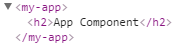
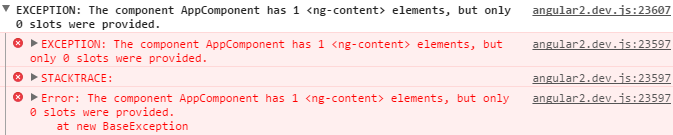
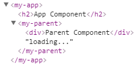
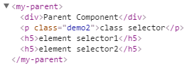
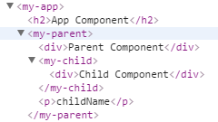
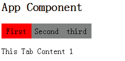

# ngContent
ngContent是Angular2的内置指令，作用类似于Angular1的ngTransclude，可以获取组件使用处标签包含的内容。例如我们App组件，默认内容是这样的

```html
<my-app>loading...</my-app>
```

如果没有使用ngContent，Angular2会直接将标签包含的内容替换成渲染后的模板，例如

*app.ts*

```typescript
import {Component} from 'angular2/core';

@Component({
    selector: 'my-app',
    template: `
        <h2>App Component</h2>
    `
})
export class AppComponent {   
}
```

渲染后的页面



如果我们想保留my-app之间的内容怎么办？这时候我们可以使用ngContent指令

*app.ts*

```typescript
import {Component} from 'angular2/core';

@Component({
    selector: 'my-app',
    template: `
        <h2>App Component</h2>
		<ng-content></ng-content>
    `
})
export class AppComponent {   
}
```



报错了，这是为什么呢？
> 这是Angular2的安全策略，入口组件不可以使用ngContent、输入输出等可以和外部交互的功能

我们重新新建一个组件，来试验ngContent指令

*parent.ts*

```typescript
import {Component} from 'angular2/core';

@Component({
    selector: 'my-parent',
    template: `
        <div>Parent Component</div>
        <ng-content></ng-content>
    `
})
export class ParentComponent {
}
```

*app.ts*

```typescript
import {Component}       from 'angular2/core';
import {ParentComponent} from './parent';

@Component({
    selector: 'my-app',
    template: `
        <h2>App Component</h2>
        <my-parent>loading...</my-parent>
    `,
    directives:[ParentComponent]
})
export class AppComponent {
}
```

最后渲染的结构是这样的，ngContent被直接替换成了<parent>之间的内容



ngContent支持select属性，值是css选择器的语法，例如

```html
<my-parent>
    <p id="demo1">id selector</p>
    <p class="demo2">class selector</p>
    <h5>element selector1</h5>
    <h5>element selector2</h5>
</my-parent>
```

```html
<div>Parent Component</div>
<ng-content select=".demo2"></ng-content>
<ng-content select="h5"></ng-content>
<ng-content select="#demo1"></ng-content>
```

渲染的结构为



> 不支持id选择器，相同的选择器只会保留一处，不会重复渲染

# ContentChild
如果my-parent标签之间包含了另一个组件而不是普通的HTML元素的时候，我们怎么获取包含的组件呢？这个时候可以通过@ContentChild装饰器获取

*child.ts*

```typescript
import {Component} from 'angular2/core';

@Component({
    selector: 'my-child',
    template: `
        <div>Child Component</div>
    `
})
export class ChildComponent {
    name:string = 'childName';
}
``` 

*parent.ts*

```typescript
import {Component,ContentChild} from 'angular2/core';
import {ChildComponent}         from './child';

@Component({
    selector: 'my-parent',
    template: `
        <div>Parent Component</div>
        <ng-content></ng-content>
        <p>{{child.name}}</p>
    `
})
export class ParentComponent {
    @ContentChild(ChildComponent)
    child:ChildComponent;
}
```

*app.ts*

```typescript
import {Component}       from 'angular2/core';
import {ParentComponent} from './parent';
import {ChildComponent}  from './child';

@Component({
    selector: 'my-app',
    template: `
        <h2>App Component</h2>
        <my-parent>
           <my-child></my-child>
        </my-parent>
    `,
    directives:[ParentComponent,ChildComponent]
})
export class AppComponent {
}
```

最终页面效果



ContentChildren可以获取多个子组件，例如

*child.ts*

```typescript
import {Component} from 'angular2/core';

@Component({
    selector: 'my-child',
    template: `
        <div>Child Component</div>
    `
})
export class ChildComponent {
    name:string = 'childName';
}
``` 

*parent.ts*

```typescript
import {Component,ContentChildren,QueryList,AfterContentInit} from 'angular2/core';
import {ChildComponent} from './child';

@Component({
    selector: 'my-parent',
    template: `
        <div>Parent Component</div>
        <p *ngFor="#child of childs;#i=index">{{child.name}}-{{i}}</p>
    `
})
export class ParentComponent implements AfterContentInit{

    @ContentChildren(ChildComponent)
    childs:QueryList<ChildComponent>;

    ngAfterContentInit() {
        console.log(this.childs)
    }
}
```

*app.ts*

```typescript
import {Component}       from 'angular2/core';
import {ParentComponent} from './parent';
import {ChildComponent}  from './child';

@Component({
    selector: 'my-app',
    template: `
        <h2>App Component</h2>
        <my-parent>
           <my-child></my-child>
           <my-child></my-child>
        </my-parent>
    `,
    directives:[ParentComponent,ChildComponent]
})
export class AppComponent {
}
```

# ViewChild
通过@ViewChild可以获取我们template当中的子组件，例如

*child.ts*

```typescript
import {Component} from 'angular2/core';

@Component({
    selector: 'my-child',
    template: `
        <div>Child Component</div>
    `
})
export class ChildComponent {
    name:string = 'childName';
}
``` 

*parent.ts*

```typescript
import {Component,ViewChild,AfterViewInit} from 'angular2/core';
import {ChildComponent}         from './child';

@Component({
    selector: 'my-parent',
    template: `
       <div>Parent Component</div>
       <my-child></my-child>
    `,
    directives:[ChildComponent]
})
export class ParentComponent implements AfterViewInit{
    @ViewChild(ChildComponent)
    child:ChildComponent;

    ngAfterViewInit() {
        console.log(this.child)
    }
}
```
ViewChildren可以获取多个子组件，例如

```typescript
import {Component,ViewChildren,AfterViewInit,QueryList} from 'angular2/core';
import {ChildComponent}         from './child';

@Component({
    selector: 'my-parent',
    template: `
       <div>Parent Component</div>
       <my-child></my-child>
       <my-child></my-child>
    `,
    directives: [ChildComponent]
})
export class ParentComponent implements AfterViewInit {
    @ViewChildren(ChildComponent)
    childs:QueryList<ChildComponent>;

    ngAfterViewInit() {
        console.log(this.childs)
    }
}
```

> 需要区分ContentChid和ViewChild

- ContentChild是组件标签闭合之间的子组件
- ViewChild是组件template当中的子组件
- 两者都有复数形式，ContentChildren和ViewChildren

> 什么时候获取到子组件的值

- ContentChild在父组件生命周期函数ngAfterContentInit之后可以获取到
- ViewChild在父组件生命周期函数ngAfterViewInit之后可以获取到

# tab小插件
一般来说我们的tab插件结构应该是这样的，层次清晰明了

```html
<tabs>
    <tab>
        <p>This Tab Content 1</p>
    </tab>
    <tab>
        <p>This Tab Content 1</p>
    </tab>
    <tab>
        <p>This Tab Content 1</p>
    </tab>
</tabs>
```

而不是写成这样

```html
<tabs [contens]="[...]"></tabs>
```

把tab的内容都当参数去传递，这样组件的可读性就会很差，不利于维护，要实现类似第一种层次清晰的结构，很明显要使用到ContentChildren的装饰器去获取子组件，下面查完完整的编码

*tab.ts*

```typescript
import {Component,Input} from 'angular2/core';

@Component({
    selector: 'tab',
    template: `
        <p [hidden]="!show">
            <ng-content></ng-content>
        </p>
    `
})
export class TabComponent {
    @Input()
    tabTitle:string;

    show:boolean = false;
}
```

*tabs.ts*

```typescript
import {Component,ContentChildren,QueryList,AfterContentInit} from 'angular2/core';
import {TabComponent} from './tab';

@Component({
    selector: 'tabs',
    template: `
       <ul class="tab-list">
           <li *ngFor="#tab of tabs" [class.active]="selectedTab===tab" (click)="onSelect(tab)">{{tab.tabTitle}}</li>
       </ul>
       <ng-content></ng-content>
    `,
    styles: [`
        .tab-list{
            list-style:none;
            overflow:hidden;
            padding:0;
        }

        .tab-list li{
            cursor:pointer;
            float:left;
            width:60px;
            height:30px;
            line-height:30px;
            text-align:center;
            background-color:gray;
        }

        .tab-list li.active{
            background-color:red;
        }
    `]
})
export class TabsComponent implements AfterContentInit {
    @ContentChildren(TabComponent)
    tabs:QueryList<TabComponent>;

    selectedTab:TabComponent;

    ngAfterContentInit() {
        this.select(this.tabs.first);
    }

    onSelect(tab) {
        this.select(tab);
    }

    select(tab) {
        this.tabs.forEach((item)=>{
            item.show = false;
        });

        this.selectedTab = tab;
        this.selectedTab.show = true;
    }
}
```

*app.ts*

```typescript
import {Component,ContentChildren,QueryList} from 'angular2/core';
import {TabsComponent} from './tabs';
import {TabComponent} from './tab';

@Component({
    selector: 'my-app',
    template: `
        <h2>App Component</h2>
        <tabs>
            <tab tabTitle="First">
                <p>This Tab Content 1</p>
            </tab>
            <tab tabTitle="Second">
                <p>This Tab Content 2</p>
            </tab>
            <tab tabTitle="third">
                <p>This Tab Content 3</p>
            </tab>
        </tabs>
    `,
    directives: [TabsComponent,TabComponent]
})
export class AppComponent {
}
```



[示例代码参考](https://github.com/yuyang041060120/yuyang041060120.github.io/tree/master/angular2/code/contentchild_and_viewchild)